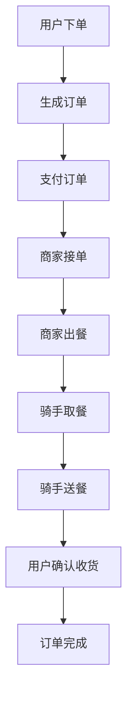
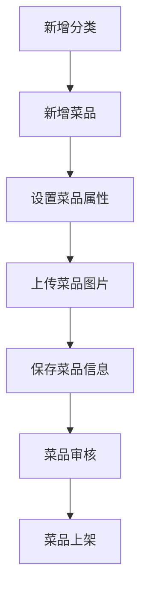

# 苍穹外卖项目技术文档

## 1. 项目概述

苍穹外卖是一个完整的餐饮外卖系统，包含后台管理系统和移动端用户系统。系统支持菜品管理、套餐管理、订单管理、用户管理、数据统计等核心功能，为餐饮企业提供一站式的线上运营解决方案。

### 1.1 主要功能

- **后台管理系统**：员工管理、分类管理、菜品管理、套餐管理、订单管理、数据统计、店铺管理
- **移动端用户系统**：用户注册登录、地址管理、菜品浏览、购物车管理、订单提交、支付功能、订单查询

### 1.2 项目价值

- 提升餐饮企业的运营效率
- 拓展销售渠道，增加营收
- 提供数据支撑，辅助经营决策
- 改善用户体验，提高客户满意度

## 2. 技术栈

### 2.1 后端技术

| 技术 | 版本 | 用途 |
|------|------|------|
| Spring Boot | 3.0+ | 应用框架 |
| Spring MVC | 集成 | Web层框架 |
| MyBatis-Plus | 集成 | ORM框架 |
| MySQL | 8.0+ | 数据库 |
| Redis | 7.0+ | 缓存 |
| JWT | 集成 | 身份认证 |
| WebSocket | 集成 | 实时通信 |
| Apache POI | 集成 | Excel报表 |
| Aliyun OSS | 集成 | 图片存储 |
| 微信支付 | 集成 | 支付功能 |

### 2.2 前端技术

- Vue 3
- Element Plus
- Axios
- Vue Router
- Pinia
- Vant（移动端）

## 3. 项目结构

### 3.1 模块划分

```
sky-take-out/
├── sky-common/          # 通用模块
│   ├── src/main/java/com/sky/
│   │   ├── constant/     # 常量定义
│   │   ├── context/      # 上下文
│   │   ├── enumeration/  # 枚举类
│   │   ├── exception/    # 异常类
│   │   ├── json/         # JSON处理
│   │   ├── properties/   # 配置属性
│   │   ├── result/       # 响应结果
│   │   └── utils/        # 工具类
│   └── pom.xml
├── sky-pojo/            # 数据模型模块
│   ├── src/main/java/com/sky/
│   │   ├── dto/          # 数据传输对象
│   │   ├── entity/       # 实体类
│   │   └── vo/           # 视图对象
│   └── pom.xml
├── sky-server/          # 主应用模块
│   ├── src/main/java/com/sky/
│   │   ├── annotation/   # 自定义注解
│   │   ├── aspect/       # 切面
│   │   ├── config/       # 配置类
│   │   ├── controller/   # 控制器
│   │   ├── handler/      # 处理器
│   │   ├── interceptor/  # 拦截器
│   │   ├── mapper/       # 映射器
│   │   ├── service/      # 服务层
│   │   ├── task/         # 定时任务
│   │   ├── websocket/    # WebSocket
│   │   └── SkyApplication.java  # 应用启动类
│   ├── src/main/resources/
│   │   ├── mapper/       # XML映射文件
│   │   ├── template/     # 模板文件
│   │   ├── application-dev.yml  # 开发环境配置
│   │   └── application.yml      # 主配置文件
│   └── pom.xml
├── .gitignore
└── pom.xml              # 父工程配置
```

### 3.2 核心模块说明

| 模块 | 主要职责 | 文件位置 |
|------|---------|----------|
| 通用模块 | 提供系统通用功能和工具 | sky-common/ |
| 数据模型模块 | 定义系统数据结构 | sky-pojo/ |
| 主应用模块 | 实现业务逻辑和接口 | sky-server/ |

## 4. 系统架构

### 4.1 架构设计

系统采用分层架构设计，遵循RESTful API设计规范，实现前后端分离。

**架构层次**：
1. **表现层（Controller）**：处理HTTP请求，返回响应结果
2. **业务逻辑层（Service）**：实现核心业务逻辑
3. **数据访问层（Mapper）**：与数据库交互
4. **数据模型层（Entity/DTO/VO）**：定义数据结构
5. **通用层（Common）**：提供通用功能和工具

### 4.2 核心流程图

#### 4.2.1 订单处理流程



#### 4.2.2 菜品管理流程



## 5. 核心功能模块

### 5.1 用户管理

**功能说明**：
- 员工管理：新增、编辑、查询、禁用/启用员工
- 用户管理：用户注册、登录、信息管理

**核心API**：
- POST /admin/employee/login - 员工登录
- POST /admin/employee - 新增员工
- GET /admin/employee/page - 员工分页查询
- PUT /admin/employee/status - 修改员工状态
- POST /user/login - 用户登录（微信小程序）

### 5.2 菜品管理

**功能说明**：
- 分类管理：菜品分类的增删改查
- 菜品管理：菜品的增删改查、上下架
- 口味管理：菜品口味的设置

**核心API**：
- POST /admin/category - 新增分类
- GET /admin/category/page - 分类分页查询
- POST /admin/dish - 新增菜品
- GET /admin/dish/page - 菜品分页查询
- PUT /admin/dish/status - 修改菜品状态
- GET /user/dish/list - 用户端获取菜品列表

### 5.3 套餐管理

**功能说明**：
- 套餐管理：套餐的增删改查、上下架
- 套餐菜品：套餐包含的菜品管理

**核心API**：
- POST /admin/setmeal - 新增套餐
- GET /admin/setmeal/page - 套餐分页查询
- PUT /admin/setmeal/status - 修改套餐状态
- GET /user/setmeal/list - 用户端获取套餐列表

### 5.4 订单管理

**功能说明**：
- 订单管理：订单的查询、接单、拒单、取消
- 订单统计：订单数据统计
- 支付功能：微信支付集成

**核心API**：
- POST /user/order/submit - 用户提交订单
- GET /user/order/page - 用户订单分页查询
- POST /admin/order/confirm - 商家接单
- POST /admin/order/rejection - 商家拒单
- GET /admin/order/page - 后台订单分页查询

### 5.5 数据统计

**功能说明**：
- 运营数据：销售额、订单量、用户数等统计
- 销售报表：菜品销售排行、订单趋势等
- 数据导出：Excel报表导出

**核心API**：
- GET /admin/report/turnoverStatistics - 营业额统计
- GET /admin/report/userStatistics - 用户统计
- GET /admin/report/orderStatistics - 订单统计
- GET /admin/report/salesTop10 - 销售排行
- GET /admin/workspace - 工作台数据

## 6. 数据库设计

### 6.1 核心数据表

| 表名 | 描述 | 核心字段 |
|------|------|----------|
| employee | 员工表 | id, username, password, name, phone, sex, id_number, status, create_time, update_time, create_user, update_user |
| user | 用户表 | id, openid, name, phone, sex, id_number, avatar, create_time |
| category | 分类表 | id, type, name, sort, status, create_time, update_time, create_user, update_user |
| dish | 菜品表 | id, name, category_id, price, image, description, status, create_time, update_time, create_user, update_user |
| dish_flavor | 菜品口味表 | id, dish_id, name, value |
| setmeal | 套餐表 | id, name, category_id, price, image, description, status, create_time, update_time, create_user, update_user |
| setmeal_dish | 套餐菜品表 | id, setmeal_id, dish_id, name, price, copies |
| address_book | 地址簿表 | id, user_id, consignee, phone, province_code, province_name, city_code, city_name, district_code, district_name, detail_address, is_default |
| shopping_cart | 购物车表 | id, user_id, dish_id, setmeal_id, dish_flavor, number, amount, create_time |
| orders | 订单表 | id, number, status, user_id, address_book_id, order_time, checkout_time, pay_time, deliver_time, end_time, amount, pay_method, remark, phone, consignee, address, cancel_reason, rejection_reason, refund_time, refund_reason, refund_status, business_id, rider_id, estimated_delivery_time |
| order_detail | 订单明细表 | id, order_id, dish_id, setmeal_id, dish_flavor, name, price, copies, amount, image |

### 6.2 数据模型关系

- 一个分类可以包含多个菜品和套餐
- 一个菜品可以有多个口味
- 一个套餐可以包含多个菜品
- 一个用户可以有多个地址和购物车记录
- 一个订单可以包含多个订单明细

## 7. 关键技术实现

### 7.1 自动填充功能

**实现说明**：
- 使用自定义注解`@AutoFill`标记需要自动填充的方法
- 通过AOP切面实现创建时间、更新时间、创建人、更新人的自动填充
- 支持INSERT和UPDATE操作类型的自动填充

**核心代码**：
```java
@Target(ElementType.METHOD)
@Retention(RetentionPolicy.RUNTIME)
public @interface AutoFill {
    OperationType value();
}
```

### 7.2 JWT认证

**实现说明**：
- 使用JWT生成token
- 通过拦截器验证token的有效性
- 区分管理员和用户的token验证

**核心代码**：
- JWT工具类：`JwtUtil.java`
- 拦截器：`JwtTokenAdminInterceptor.java`、`JwtTokenUserInterceptor.java`

### 7.3 微信支付集成

**实现说明**：
- 集成微信支付SDK
- 实现统一下单、支付回调、退款等功能

**核心代码**：
- 工具类：`WeChatPayUtil.java`
- 控制器：`PayNotifyController.java`

### 7.4 阿里云OSS集成

**实现说明**：
- 集成阿里云OSS SDK
- 实现图片的上传、下载、删除功能

**核心代码**：
- 工具类：`AliOssUtil.java`
- 配置类：`OssConfiguration.java`

### 7.5 WebSocket实时通信

**实现说明**：
- 实现WebSocket服务端
- 支持订单状态实时推送
- 支持管理员和用户的消息推送

**核心代码**：
- WebSocket服务：`WebSocketServer.java`
- 任务：`WebSocketTask.java`

## 8. 配置与部署

### 8.1 环境配置

**开发环境配置**：
- 数据库：MySQL 8.0+
- Redis：7.0+
- JDK：17+
- Maven：3.8+

**配置文件**：
- `application.yml`：主配置文件
- `application-dev.yml`：开发环境配置

### 8.2 部署说明

**部署步骤**：
1. 编译打包：`mvn clean package`
2. 部署到服务器：将jar包上传到服务器
3. 启动应用：`java -jar sky-server.jar`
4. 配置Nginx反向代理（可选）

**Docker部署**：
```dockerfile
FROM openjdk:17-jdk-alpine
VOLUME /tmp
ADD sky-server.jar app.jar
ENTRYPOINT ["java","-Djava.security.egd=file:/dev/./urandom","-jar","/app.jar"]
```

## 9. 监控与维护

### 9.1 日志管理

- 使用Spring Boot默认的日志框架
- 配置不同环境的日志级别
- 关键操作记录日志

### 9.2 异常处理

- 全局异常处理器：`GlobalExceptionHandler.java`
- 自定义异常类：`BaseException.java`及其子类
- 统一错误响应格式

### 9.3 性能优化

- 使用Redis缓存热点数据
- 数据库索引优化
- 分页查询优化
- 图片存储优化（使用OSS）

## 10. 技术亮点

1. **模块化设计**：采用多模块架构，职责分明，易于维护和扩展
2. **自动填充功能**：使用AOP实现字段自动填充，减少重复代码
3. **统一异常处理**：全局异常处理器，统一错误响应格式
4. **JWT认证**：无状态认证，提高系统安全性和可扩展性
5. **WebSocket实时通信**：实现订单状态实时推送，提升用户体验
6. **阿里云OSS集成**：高效存储图片资源，提高系统性能
7. **微信支付集成**：完整的支付流程，支持多种支付场景
8. **数据统计与报表**：丰富的数据统计功能，辅助经营决策
9. **响应式设计**：前后端分离，适配不同设备
10. **安全措施**：密码加密、权限控制、SQL注入防护等

## 11. 未来规划

1. **功能扩展**：
   - 增加会员系统
   - 增加优惠券功能
   - 增加评价系统
   - 增加营销活动功能

2. **技术升级**：
   - 微服务架构改造
   - 引入分布式事务
   - 增加服务监控
   - 引入容器化部署

3. **性能优化**：
   - 引入缓存中间件
   - 数据库分库分表
   - 服务降级与熔断
   - CDN加速

## 12. 总结

苍穹外卖项目是一个功能完整、架构清晰的餐饮外卖系统，采用了主流的Java技术栈，实现了后台管理系统和移动端用户系统的完整功能。系统具有良好的可扩展性和可维护性，能够满足餐饮企业的日常运营需求。

通过本项目的实施，可以帮助餐饮企业：
- 提高运营效率，降低管理成本
- 拓展销售渠道，增加营收
- 提升品牌形象，增强市场竞争力
- 获得数据支持，优化经营决策

项目的技术实现也为类似的电商系统、O2O系统提供了参考，具有较高的学习和应用价值。